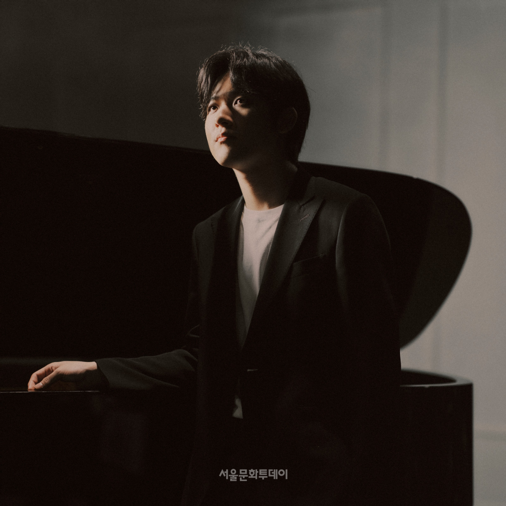
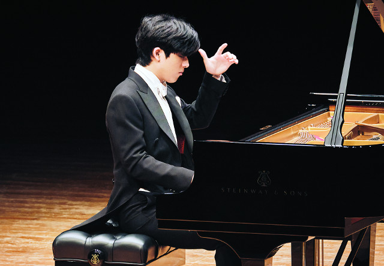

# Job Interview with Yunchan Lim

## Interviewer: Thank you for joining us today, Yunchan. To start, could you briefly introduce yourself?

**Yunchan Lim**: Thank you for having me. I’m a pianist from South Korea, and music has been at the center of my life since I was very young. I’m deeply passionate about exploring the emotional and philosophical depth of classical music through performance.

## Interviewer: What initially drew you to the piano?

**Yunchan Lim**: It felt natural. The piano offered a complete universe—melody, harmony, and structure—all in one instrument. As a child, I was fascinated not just by sound, but by how music could express things that words cannot.

## Interviewer: You gained international recognition after winning the Van Cliburn International Piano Competition. How did that experience shape you?

**Yunchan Lim**: It was a transformative moment. Beyond the recognition, it challenged me to confront my own limitations and redefine my relationship with music. Competitions are not just about winning—they are about growth, resilience, and honesty with yourself.

## Interviewer: How would you describe your artistic philosophy?

**Yunchan Lim**: I believe music is not about perfection, but about truth. Every performance should be an honest reflection of one’s inner world. Technique is important, but it serves as a tool to communicate something deeper.

## Interviewer: What are your strengths as a musician?

**Yunchan Lim**: I would say my ability to immerse myself completely in the music. I try to approach every piece with sincerity and openness, always searching for meaning rather than just accuracy.

## Interviewer: And what about areas you're still working to improve?

**Yunchan Lim**: Everything. Music is an endless journey. I constantly work on refining my interpretation, expanding my repertoire, and understanding composers more deeply.

## Interviewer: How do you handle pressure, especially on large stages?

**Yunchan Lim**: Pressure exists, but I try not to focus on it. Instead, I focus on the music itself. When I’m fully engaged with the piece, the external pressure becomes less important.

## Interviewer: Where do you see yourself in the next five to ten years?

**Yunchan Lim**: I hope to continue growing as an artist. Not just performing more, but deepening my understanding of music and connecting with audiences in a meaningful way.

## Interviewer: Finally, why should audiences listen to your performances?

**Yunchan Lim**: I don’t think of it as “why me.” I simply hope that through my playing, people can experience something genuine—something that resonates with them personally.

## Interviewer: Thank you, Yunchan. It’s been a pleasure.

**Yunchan Lim**: Thank you. It was an honor.

*This is generated by AI*
